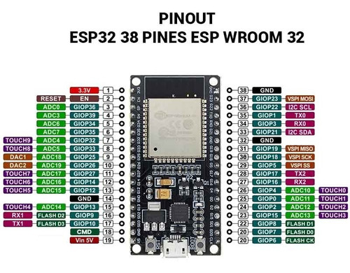
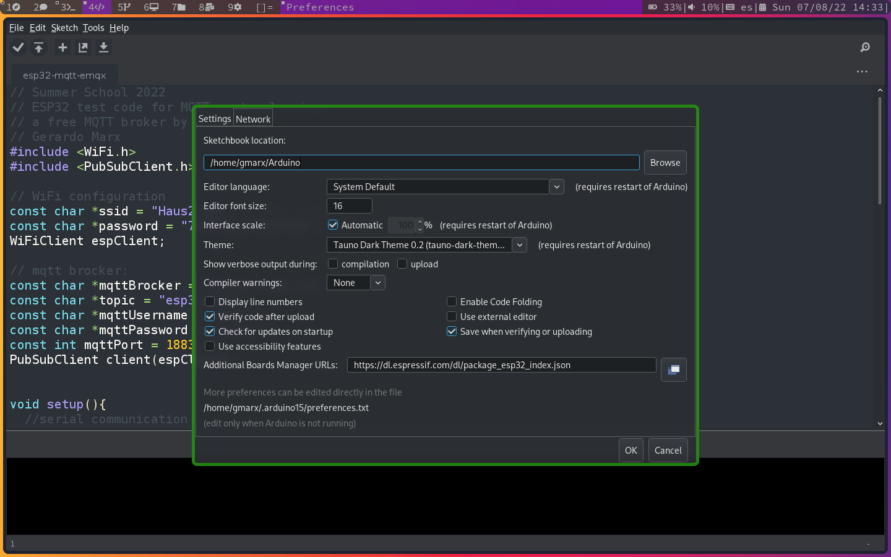
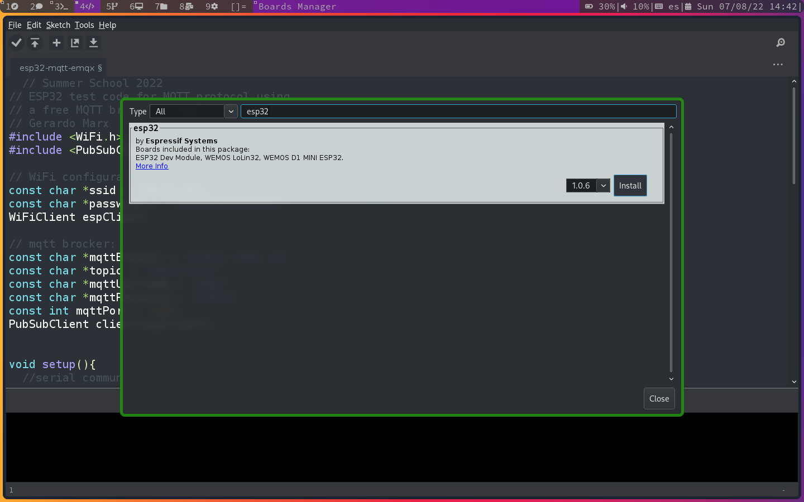

# Testing the ESP32 and Arduino IDE
## Introduction
This repository shows the basic usage of the Arduino IDE with the ESP32 development board by implementing a blinking LED and serial communication.

# Programming the ESP32 Board
For this example course, we are going to use the ESP32-S WROOM, **please check what board you are using**.


then, we need to install the Arduino IDE to program the ESP32.

## Installing the Arduino IDE

The Arduino IDE can be installed on *Windows, MacOS, or GNU Linux*, the Windows and MacOS installation is commonly using the installer. In the case of the *GNU Linux* it is highly recommended to use the distribution's package manger. In my case, the ArchLinux manager is *pacman*, thus use:

```
sudo pacman -Sy arduino
[sudo] password for gmarx:
:: Synchronizing package databases...
 core                                 157.9 KiB   235 KiB/s 00:01 [####################################] 100%
 extra                               1710.6 KiB  3.66 MiB/s 00:00 [####################################] 100%
 community                              6.7 MiB  7.49 MiB/s 00:01 [####################################] 100%
warning: arduino-1:1.8.19-1 is up to date -- reinstalling
resolving dependencies...
looking for conflicting packages...

Packages (1) arduino-1:1.8.19-1

Total Installed Size:  59.36 MiB
Net Upgrade Size:       0.00 MiB

:: Proceed with installation? [Y/n]
```

**Note: The Arduino IDE requires Java jdk8 and jre8 installed on the OS.**

**Note: You can install a Dark theme by [following these instructions]()**

## Adding the ESP32 Boards
The addition of the ESP32 boards requires to include a URL to download a *Board Manager* by clicking on `File -> Preferences` and pasting the URL `https://dl.espressif.com/dl/package_esp32_index.json` in the field *Additional Boards Manager URLs*:

```
https://dl.espressif.com/dl/package_esp32_index.json
```


Next, we can install the ESP32 board on Arduino IDE by `Tools -> Board -> Boards Manager ...`, and writte `ESP32` to install the tools required to work with:



# Sample code to test ESP32
Before start programming the ESP32 board we have to select the proper board in the `Board` tool. Thus, again open and select the `Tools -> Bord -> DOIT ESP32 DEVKIT V1`. Then, paste the next code segtion to test the ESP32 board; the code is also the `blinking-serial.ino`file:

```
  /*
 *
 * Example code for ESP32-S:
 * The code blinks the onboard LED (at D2 in GPIO 02) every 0.500 seconds.
 * The code also prints by serial communcation the word "Hello" during the
 * ON stage of the LED, and then prints "World" during the OFF.
 * Gerardo Marx 19/Jul/2022
 */

// this variable is defined in pins_arduino.h for DOIT ESP32 DEVKIT V1
// int LED_BUILTIN = 02;
int LED_ONBOARD = 02;

void setup() {
  // put your setup code here, to run once:
  pinMode(LED_BUILTIN, OUTPUT);
  //serial  monitor setup
  Serial.begin(115200);
      }

void loop() {
  // put your main code here, to run repeatedly:
  Serial.print("ON");
  digitalWrite(LED_BUILTIN, HIGH);
  delay(500);
  // after delay
  Serial.print(" - OFF\n");
  digitalWrite(LED_BUILTIN, LOW);
  delay(500);

```
next, press `Crt-u` to compile and upload the code generated into the board.

## The error `no module named serial`
If you get an error like this:
```
ModuleNotFoundError: No module named 'serial'
exit status 1
Error compiling for board DOIT ESP32 DEVKIT V1.
```

then, it is necessary to install in python:
```
pip3 install pyserial
```
and must probably you will requiere pip3 python package manager:
```
sudo pacman -Sy python-pip
```
## `Permission denied: '/dev/ttyUSB0'`
If you try to upload the code to the ESP32 board and receives the next error:

```
Permission denied: '/dev/ttyUSB0'`
```
thus, check the ttyUSB0' group by listing: 
```
ls -l /dev/ttyUSB0
crw-rw---- 1 root uucp 188, 0 Aug  7 14:50 /dev/ttyUSB0
```
next, add your user to the group and try again
```
sudo usermod -a -G uucp $USER
```
**Note: you need to relogin into you session and try to upload again.**

```
groups
libvirt uucp gmarx
```
